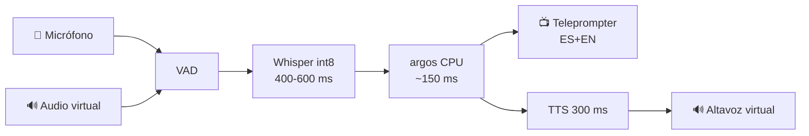

<div align="center">

# 🎙️ Traductor de Voz en Tiempo Real
### ES ↔ EN para entrevistas de trabajo — local, privado, verificable

> **Pipeline:** `audio → VAD → ASR → traducción → TTS → audio` — con texto siempre visible para detectar errores antes de responder.

[](https://github.com/KevinGracianoL/traductor-voz-entrevistas/actions)


**Portafolio → [KevinGracianoL](https://github.com/KevinGracianoL) · Proyecto guía [entrenamiento-dev](https://github.com/KevinGracianoL/entrenamiento-dev) · Hecho para entrevistas reales, no demos**

[Instalación](#-instalación) · [Uso](#️-uso) · [Arquitectura](#️-arquitectura) · [Calidad](#-calidad-5-gates-1-contrato) · [ADRs](#-decisiones-adr)

</div>

---

<div align="center">

### ✨ Demo (próximamente)

*Teleprompter ES+EN en vivo durante Zoom/Meet — el entrevistador habla inglés, tú lees en español y respondes en tu voz.*

> **Privacidad:** todo corre en tu laptop. El audio nunca sale de la máquina.

</div>

---

## 🎯 Por qué este proyecto

En una entrevista en inglés, un error de traducción no es un bug — es la respuesta equivocada. Este traductor prioriza **texto verificable** sobre voz sintética indistinguible, y **latencia medida en tu hardware** sobre benchmarks de RTX 4090.

**Para reclutadores:** cada línea es testeable, cada decisión tiene evidencia (ADRs), y `mutmut` demuestra que los tests no solo ejecutan líneas — las verifican.

---

## ✅ Estado actual

| Paso | Estado | Qué entrega |
|---|---|---|
| **1 — Hardware** | ✅ | `torch.cuda.is_available()`, VRAM libre/total, `RealtimeSTT` `tiny` `int8` (TU117) |
| **2 — Traducción** | ✅ | `argos-translate` `EN↔ES` offline en CPU, `ARGOS_COMPUTE_TYPE=default` |
| **3 — Medición** | ✅ | `latencia/presupuesto.py` + `medidor.py` (reloj inyectable, `p50` mediana, `p95=None` si `n<20`) |
| **4 — Audio virtual** | 🔜 | Mic/altavoz virtual en Windows |
| **5 — Teleprompter** | 🔜 | UI en vivo + deploy micro VM |

---

## 🏗️ Arquitectura



**Presupuesto ADR-003:** techo **1.5–2 s** total. Si no cabe, se recorta calidad, nunca latencia.

---

## 🛠️ Stack

| Capa | Tech | Nota |
|---|---|---|
| **ASR** | `RealtimeSTT` + `faster-whisper` `int8` | TU117 sin Tensor Cores → FP16 emulado, INT8 en cores enteros |
| **Traducción** | `argos-translate` + `ctranslate2` | Offline, CPU, gratis |
| **Medición** | `time.perf_counter` inyectable | Testeable sin hardware |
| **Calidad** | `ruff` `mypy --strict` `pytest` `mutmut` | 100% cov, 84/84 mutantes |

---

## 💻 Requisitos

- **Hardware referencia:** Ryzen 5 4600H / GTX 1650 Ti 4 GB (TU117) / 24 GB RAM — 0 ms de red
- Python 3.11+, CUDA 13.2, Windows 10/11, micrófono
- Descartados: `fuerzafiel` VM (947 MB RAM), server Medellín i5-3230M (sin AVX2), GPU remota MX (peaje por chunk)

---

## 🚀 Instalación

```powershell
# 1. Entorno
python -m venv venv; .\venv\Scripts\Activate.ps1

# 2. Deps (PyTorch con CUDA)
pip install -r requirements.txt --extra-index-url https://download.pytorch.org/whl/cu132
python setup_dlls.py

# 3. Verificar que local == CI
ruff check .; ruff format --check .; mypy .; pytest
```

---

## ▶️ Uso

```powershell
python paso1_verificar.py   # → CUDA: True | GTX 1650 Ti | VRAM 3.2/4 GB | "the blue dog..." → texto
python paso2_traducir.py    # → "Tell me about a hard bug..." ↔ "Háblame de un bug..."
```

```python
from latencia.presupuesto import cabe_en_presupuesto
from latencia.medidor import medir_tiempo
import time

# ¿Cabe en 1 s?
cabe_en_presupuesto({"asr": 500, "traduccion": 150, "tts": 300}, 1000)  # True

# Medir (tests usan reloj falso, prod usa perf_counter)
texto, ms = medir_tiempo(lambda: traducir("hello", "en", "es"), clock=time.perf_counter)
```

---

## 📁 Estructura

```
├── paso1_verificar.py      # CUDA + micrófono → texto
├── paso2_traducir.py       # argos EN↔ES bidireccional
├── latencia/
│   ├── presupuesto.py      # ¿cabe? ¿quién es más lento? (puro cálculo)
│   └── medidor.py          # reloj inyectable, p50/p95 honesto
├── tests/
│   ├── test_presupuesto.py # 13 tests — frontera inclusiva, converge
│   └── test_medidor.py     # 13 tests — elapsed en exc, p95 None
├── .github/workflows/ci.yml
├── pyproject.toml          # ruff + mypy strict + pytest --cov-fail-under=90 + mutmut --no-cov
└── requirements.txt
```

---

## ✅ Calidad — 5 gates, 1 contrato

| Pregunta | Herramienta | Config |
|---|---|---|
| ¿Legible/sin bug? | **ruff** | `select = ["E","F","B","SIM","UP","I","S"]` |
| ¿Tipos encajan? | **mypy --strict** | `ignore_missing_imports` para RealtimeSTT |
| ¿Hace lo que digo? | **pytest** | `--cov-fail-under=90` en `pyproject.toml` |
| ¿Qué no probé? | **coverage** | `100%` |
| ¿Detectaría un bug? | **mutmut** | `84/84` con `pytest_add_cli_args = ["--no-cov"]` |

> `mutmut` necesita `fork` → WSL. En CI (Ubuntu) el gate falla si `survived > 0`. Verificado rompiendo `<=`→`<` y `*1000`→`/1000` a mano.

---

## 📋 ADRs — decisiones con evidencia

| # | Decisión | Por qué |
|---|---|---|
| 001 | Cascada, no end-to-end | Texto verificable > latencia mínima |
| 002 | Audio virtual a nivel SO | Funciona con cualquier Meet/Zoom sin API |
| 003 | Techo 1.5–2 s | Recorta calidad, nunca latencia |
| 004 | INT8, no FP16 | TU117 sin Tensor Cores, FP16 emulado |
| 005 | Local, no remoto | AVX2+CUDA+0 ms gana a geografía |
| 006 | Sobre RealtimeSTT | VAD/ASR commodity, nosotros orquestamos |
| 007 | Teleprompter primero | Semanas vs meses, honestidad en entrevista |
| 008 | Fallback automático | Una entrevista no es un log |
| 009 | Dirección por fuente | Determinista, 0 ms, sin detector que falle en code-switching |

---

## 🗺️ Roadmap

- [x] Paso 3 — Medidor honesto (p95, `exc.elapsed_ms`)
- [ ] Paso 4 — Audio virtual Windows + warm-up CUDA descartado
- [ ] Paso 5 — Teleprompter + deploy VM (nginx + TLS)
- [ ] Fase 2 — TTS opcional
- [ ] Fase 3 — Conversión de voz (timbre de Kevin)

---

<div align="center">

**Hecho por [Kevin Graciano](https://github.com/KevinGracianoL) — aprendiendo en público, midiendo en mi hardware.**

*Cero credenciales y cero audios de entrevistas reales en el historial.*

</div>
