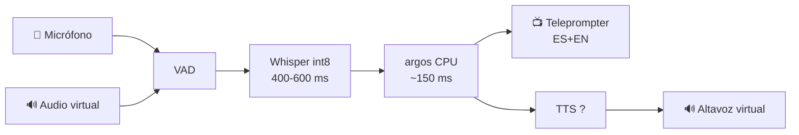

<div align="center">

# 🎙️ Traductor de Voz en Tiempo Real

### ES ↔ EN para entrevistas de trabajo — **100 % local, privado y verificable**

> `audio → VAD → ASR → traducción → TTS → audio` — el texto siempre está en pantalla, así detectas un error de traducción **antes** de responder.

[](https://github.com/KevinGracianoL/traductor-voz-entrevistas/actions)


**Demo en vivo → [traductor-demo.kevingraciano.dev](https://traductor-demo.kevingraciano.dev)** · **Por [Kevin Graciano](https://github.com/KevinGracianoL)**

*Un traductor pensado para entrevistas reales — no para demos. Construido con gates de calidad de producción y decisiones con evidencia (ADRs).*

</div>

---

## 🎯 Qué resuelve

En una entrevista en inglés, un error de traducción no es un bug — **es la respuesta equivocada**.

Este proyecto prioriza **texto verificable** sobre voz sintética indistinguible, y **latencia medida en tu hardware** sobre benchmarks de RTX 4090 que no se cumplen en tu laptop.

Tres decisiones que lo separan de un "hello world" con APIs:

1. **Privacidad real** — el audio nunca sale de la máquina. El pipeline completo corre local (CPU + GPU propia), sin nube.
2. **Cero magia** — cada etapa es una función pura y testeada: micrófono → VAD → ASR → traducción → teleprompter.
3. **Evidencia sobre opinión** — 10 ADRs, cada decisión con su porqué medido. El TTS elegido se rechazó con números reales, no con intuición.

---

## 🏗️ Arquitectura



**Presupuesto de latencia (ADR-003):** techo de **1,5–2 s** total. Si no cabe, se recorta calidad — nunca latencia.

---

## ✅ Calidad — 5 gates, 1 contrato

| Pregunta | Herramienta | Config |
|---|---|---|
| ¿Legible y sin bugs? | **ruff** | `select = ["E","F","B","SIM","UP","I","S"]` |
| ¿Los tipos encajan? | **mypy --strict** | errores de tipo = CI rojo |
| ¿Hace lo que dice? | **pytest** | `--cov-fail-under=90` |
| ¿Qué no probé? | **coverage** | **100 %** (743 stmts, 0 sin cubrir) |
| ¿Detectaría un bug? | **mutmut** | **0 supervivientes** — el gate CI falla si `survived > 0` |

> `mutmut` muta tu código a propósito (cambia `<=`→`<`, `*1000`→`/1000`, borra branches…) y exige que **alguien** lo detecte. El gate CI falla si `survived > 0`. Se verificó a mano rompiendo el código y viendo el gate rechazarlo.
>
> **235 tests** cubren el happy path **y** los modos de fallo: locks de antivirus, escrituras truncadas, `.tmp` huérfanos, rutas Windows con backslash/apóstrofo.

---

## 🔥 Lo que los bugs enseñaron (y que quedó como test)

Este proyecto se desarrolló con un revisor estricto a lo largo de **8 rondas de review**. Cada bug real dejó una regresión test, no un parche:

- **Coexistencia CUDA 12/13 en una misma máquina.** torch 2.13 trae `cudart64_13`, pero `ctranslate2` necesita `cublas/cudart 12` → `RuntimeError: Library cublas64_12.dll is not found`. La solución (`setup_dlls.py`) copia **exactamente 3 DLLs** y registra los dirs de búsqueda vía `.pth` + `os.add_dll_directory`. Verificado en hardware real: `docs/smoke-windows.txt`.
- **Locks del antivirus en Windows.** Sobrescribir/borrar un `.dll` recién escrito falla mientras el AV lo escanea; *renombrarlo sí funciona*. `copiar_dlls` toma un backup inmutable, reintenta con backoff y **nunca deja el venv sin DLL ni con una DLL truncada** (3 invariantes de rollback).
- **100 % de cobertura ≠ cobertura de modos de fallo.** El bug de r5 solo aparecía con un *doble sucio* (escribe basura y luego revienta); los dobles limpios `raise`-y-ya lo dejaban pasar. Ese doble es hoy un test.
- **Un namespace package fantasma.** `makedirs` fabricaba un `ctranslate2/` vacío que enmascaraba una instalación rota. Ahora `dir_ct2()` deriva del paquete real y falla claro.

Cada uno de estos escenarios tiene su test **RED → GREEN**: se escribió el test, se vio fallar contra el código roto, y luego se arregló.

---

## 🛠️ Stack

| Capa | Tech | Nota |
|---|---|---|
| **ASR** | `RealtimeSTT` + `faster-whisper` `int8` | TU117 sin Tensor Cores → FP16 emulado, INT8 en cores enteros |
| **Traducción** | `argos-translate` + `ctranslate2` | Offline, CPU, gratis |
| **Medición** | `time.perf_counter` inyectable | Testeable sin hardware |
| **UI** | `FastAPI` + teleprompter ES+EN | `localhost:8000`, deploy Caddy |
| **Calidad** | `ruff` · `mypy --strict` · `pytest` · `mutmut` | 5 gates, CI en GitHub Actions |

---

## 💻 Requisitos

- **Hardware de referencia:** Ryzen 5 4600H / GTX 1650 Ti 4 GB (TU117) / 24 GB RAM — 0 ms de red
- Python 3.11+, CUDA 13.2, Windows 10/11, micrófono

---

## 🚀 Instalación

```powershell
# 1. Entorno
python -m venv venv; .\venv\Scripts\Activate.ps1

# 2. Deps (PyTorch con CUDA)
pip install -r requirements.txt --extra-index-url https://download.pytorch.org/whl/cu132
python setup_dlls.py

# 3. Verificar que local == CI
ruff check .; ruff format --check .; mypy .; pytest
```

## ▶️ Uso

```powershell
$env:PYTHONPATH = "src"
python scripts/verificar_hardware.py  # → CUDA: True | GTX 1650 Ti | VRAM 3.2/4 GB | mic → texto
python scripts/demo_traduccion.py     # → "Tell me about a hard bug..." ↔ "Háblame de un bug..."
```

```python
from traductor.latencia.presupuesto import cabe_en_presupuesto
from traductor.latencia.medidor import medir_tiempo
from traductor.traduccion.argos import traducir
import time

# ¿Cabe en 1 s?
cabe_en_presupuesto({"asr": 500, "traduccion": 150, "tts": 300}, 1000)  # True

# Medir (los tests usan reloj falso, prod usa perf_counter)
texto, ms = medir_tiempo(lambda: traducir("hello", "en", "es"), clock=time.perf_counter)
```

---

## 📁 Estructura

```
├── src/traductor/
│   ├── hardware/cuda.py        # verifica GPU/VRAM
│   ├── audio/captura.py        # mic → texto (RealtimeSTT)
│   ├── audio/virtual.py        # ruta determinista por nombre (VB-CABLE)
│   ├── traduccion/argos.py     # EN↔ES offline
│   ├── asr/                    # benchmark ASR (ADR-012, Propuesto)
│   │   ├── wer.py              # WER puro + normalización (minúsculas, sin punt.)
│   │   ├── manifesto.py        # manifest JSON validado (rutas, idioma, ref)
│   │   ├── medicion.py         # loop motor×muestra con reloj inyectable
│   │   └── benchmark.py        # agregación p50/p95 + wer_n + tabla
│   ├── tts/                    # contratos neutrales (ADR-011, Propuesto)
│   │   ├── modelos.py          # VoiceProfile, AudioResult, Salud
│   │   ├── backend.py          # TTSBackend (Protocol)
│   │   ├── tienda.py           # VoiceProfileStore (Protocol)
│   │   ├── tienda_json.py      # store real: un JSON por perfil (ADR-013)
│   │   ├── enrolamiento.py     # muestras → VoiceProfile validado (ADR-013)
│   │   ├── worker.py           # worker aislado: jobs JSON-line (ADR-013)
│   │   ├── gates.py            # go/no-go: 9 gates del motor (ADR-014)
│   │   └── backend_xtts.py     # XTTS-v2 vía fork coqui-tts (ADR-011)
│   └── latencia/
│       ├── presupuesto.py      # ¿cabe? ¿quién es más lento?
│       └── medidor.py          # reloj inyectable, p50/p95 honesto
├── scripts/                    # wrappers finos: hardware, traducción
├── setup_dlls.py               # CUDA 12/13 coexistiendo (Windows, locks AV)
├── docs/                       # ADRs + evidencia smoke Windows
├── tests/                      # 235 tests, 100 % cov, mutantes en CI
└── .github/workflows/ci.yml    # 5 gates que fallan el PR si algo se rompe
```

---

## 📋 ADRs — decisiones con evidencia

| # | Decisión | Por qué |
|---|---|---|
| 001 | Cascada, no end-to-end | Texto verificable > latencia mínima |
| 002 | Audio virtual a nivel SO | Funciona con cualquier Meet/Zoom sin API |
| 003 | Techo 1,5–2 s | Recorta calidad, nunca latencia |
| 004 | INT8, no FP16 | TU117 sin Tensor Cores, FP16 emulado |
| 005 | Local, no remoto | AVX2+CUDA+0 ms gana a geografía |
| 006 | Sobre RealtimeSTT | VAD/ASR commodity, nosotros orquestamos |
| 007 | Teleprompter primero | Semanas vs meses, honestidad en entrevista |
| 008 | Fallback automático | Una entrevista no es un log |
| 009 | Dirección por fuente | Determinista, 0 ms, sin detector que falle en code-switching |
| 010 | **Chatterbox rechazado como TTS** | [ADR-010](docs/ADR-010-chatterbox-rechazado.md): 17,4 s warm / 3,6 GB **medidos** en esta GPU, sin co-residencia con Whisper |
| 011 | **XTTS-v2 primario (fork coqui-tts)** | [ADR-011](docs/ADR-011-contratos-neutrales-tts.md): CPML declarado (uso personal no comercial); Supertonic+OpenVoice V2 como B; Pocket descartado |
| 012 | **Benchmark ASR bidireccional** | [ADR-012](docs/ADR-012-benchmark-asr.md): Moonshine Small CPU vs faster-whisper Small GPU; WER normalizado + p50/p95 |
| 013 | **Worker TTS aislado + enrolamiento** | [ADR-013](docs/ADR-013-worker-tts-enrolamiento.md): jobs JSON-line, frontera de entrada, tienda local |
| 014 | **Gates de aceptación del motor** | [ADR-014](docs/ADR-014-gates-aceptacion-tts.md): TTFA derivado de etapas medidas (2000 ms − ASR − traducción − ruteo), VRAM<3,2 GB, RAM<18 GB, sin OOM/artefactos, endurance 90 min |
| 015 | **Arquitectura por flujos y escalera** | [ADR-015](docs/ADR-015-arquitectura-flujos-escalera.md): outgoing/incoming, colas de tamaño 1, validación de artefactos, 4 niveles |

---

## 🗺️ Roadmap

- [x] **Paso 1 — Hardware** — CUDA + VRAM + mic → texto
- [x] **Paso 2 — Traducción** — `argos` offline EN↔ES
- [x] **Paso 3 — Medición** — presupuesto + medidor honesto (`p95`, `exc.elapsed_ms`)
- [x] **Paso 4 — Audio virtual** — ruta por nombre, VB-CABLE
- [x] **Paso 5 — Teleprompter** — UI en vivo + deploy (nginx + TLS)
- [x] **Fase 2a — DLLs CUDA en Windows** — torch 2.13 (CUDA 13) conviviendo con ctranslate2 (CUDA 12)
- [x] **Fase 2b — Contratos TTS** — `VoiceProfile`/`VoiceProfileStore`/`TTSBackend` (ADR-011, Propuesto)
- [x] **Fase 2c — Benchmark ASR** — WER + p50/p95: faster-whisper vs moonshine (ADR-012, Propuesto)
- [x] **Fase 2d — Worker TTS + enrolamiento** — worker aislado + tienda JSON (ADR-013, Propuesto)
- [x] **Fase 2e — Gates TTS** — 9 gates del go/no-go: TTFA, VRAM, RAM, pipeline, OOM, memoria, artefactos, A/B, endurance (ADR-014, Propuesto)
- [x] **Fase 2f — Go/no-go del motor TTS** — XTTS-v2 **rechazado con fundamento**: pipeline end-to-end medido 2532.4 ms > 2000 ms (ASR 773.1 + traducción 175.0 + TTFA 1er chunk 686.0 + ruteo primer-sample 221.0; presupuesto TTFA derivado PASA por primera vez) — dos métricas mal definidas corregidas con evidencia en [ADR-014](docs/ADR-014-gates-aceptacion-tts.md); candidato B (Supertonic 3 + OpenVoice V2) **rechazado** por TTFA arquitectural (7885.8 ms)
- [ ] **Fase 2g — Motor TTS que pase los gates** — **ningún motor pasa hoy**: ni los clones (XTTS ✗, B ✗, Pocket descartado) ni la voz genérica Supertonic sola (~1.75 s por fragmento > 400 ms); este ítem rastrea el hueco y el flujo arranca por la escalera del ADR-015 (nivel 3: voz genérica + subtítulos)
- [ ] **Fase 3 — Conversión de voz** — timbre de Kevin (condicionada a un motor que pase los gates del ADR-014, Fase 2g)

---

<div align="center">

**Hecho por [Kevin Graciano](https://github.com/KevinGracianoL)** — aprendiendo en público, midiendo en mi propio hardware.

*Privacidad por diseño: cero audios de entrevistas reales y cero credenciales en el historial del repo.*

</div>


