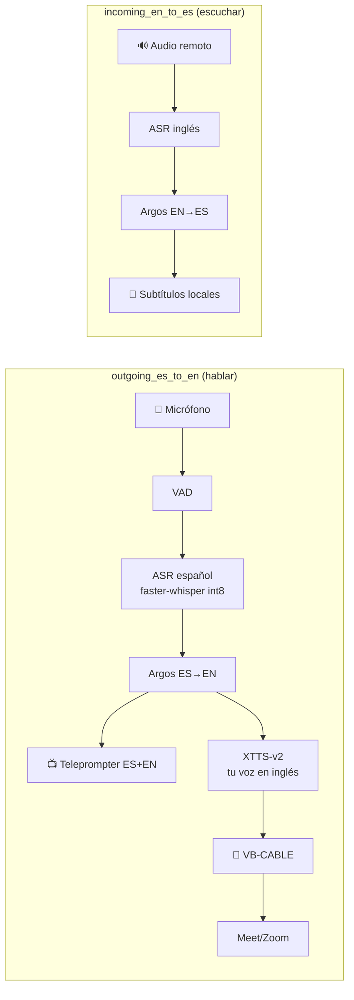

<div align="center">

# 🎙️ Traductor de Voz en Tiempo Real

### ES ↔ EN para entrevistas de trabajo — **100 % local, privado y medido en mi propio hardware**

> `audio → VAD → ASR → traducción → TTS → audio` — el texto siempre está en pantalla, así detectas un error de traducción **antes** de responder.

[](https://github.com/KevinGracianoL/traductor-voz-entrevistas/actions)


**Demo en vivo → [traductor-demo.kevingraciano.dev](https://traductor-demo.kevingraciano.dev)** · **Por [Kevin Graciano](https://github.com/KevinGracianoL)**

*Un traductor pensado para entrevistas reales — no para demos. Cada decisión tiene su ADR, cada ADR tiene sus números, y los números se tomaron en la máquina que va a sostener la entrevista.*

</div>

---

## 🏆 El veredicto (y cómo se ganó)

Después de **tres rondas de medición en hardware real** —y de que las dos primeras métricas que definí resultaran estar mal especificadas—, el motor elegido pasó el go/no-go con evidencia atribuida al 100 %:

| Gate | Medido | Límite | Veredicto |
|---|---|---|---|
| **Pipeline end-to-end** (audio → primer sample audible en VB-CABLE, una corrida encadenada) | **peor caso 1469.3 ms** (rango 1237.0–1469.3, 4 corridas) | < 2000 ms | ✅ **PASA** (margen 531 ms) |
| TTFA primer chunk (presupuesto **derivado**: 2000 − ASR − traducción − ruteo) | 723–755 ms < 767–826 ms | derivado | ✅ PASA |
| VRAM co-residente (XTTS + Whisper) | 2906.9–2946.9 MiB | < 3276.8 | ✅ PASA |
| RAM total (contexto anotado) | 13.0–13.9 GB | < 18 GB | ✅ PASA |
| Tasa de fallo (disponibilidad) | **5 % (1 de 20 corridas)** — la etapa de traducción murió por una descarga on-demand de spacy | 0 % | ⚠️ Declarada aparte → precarga bloqueante del flujo |
| A/B de voz (tu oído + evidencia objetiva) | timbre, ritmo 96–150 wpm, palabras técnicas claras | firma humana | ✅ Firmado |

**¿Por qué importa?** El techo de 1,5–2 s del ADR-003 **no se inventó ni se copió de un benchmark**: se midió la cadena completa *en esta GPU de 4 GB*, con el ASR co-residente y el micrófono virtual real. La historia completa de las dos métricas mal definidas que detecté yo mismo, corregí y convertí en reglas, vive en [ADR-014](docs/ADR-014-gates-aceptacion-tts.md) — cinco capas de evidencia, ninguna borrada.

---

## 🎯 Qué resuelve

En una entrevista en inglés, un error de traducción no es un bug — **es la respuesta equivocada**.

Este proyecto prioriza **texto verificable** sobre voz sintética indistinguible, y **latencia medida en tu hardware** sobre benchmarks de RTX 4090 que no se cumplen en tu laptop.

1. **Privacidad real** — el audio nunca sale de la máquina. Todo corre local (CPU + GPU propia), sin nube, sin APIs.
2. **Cero magia** — cada etapa es una función pura y testeada: micrófono → VAD → ASR → traducción → teleprompter → voz.
3. **Evidencia sobre opinión** — 16 ADRs, cada decisión con su porqué medido. El motor de voz se rechazó **dos veces** con números antes de aceptarse con números.

---

## 🏗️ Arquitectura

Dos flujos explícitos (ADR-015) con workers persistentes, colas de tamaño 1, cancelación y degradación automática sin reiniciar la llamada:



**Escalera de degradación (sin reiniciar la entrevista):** voz clonada + subtítulos → voz genérica + subtítulos → solo subtítulos. Y antes de que un audio defectuoso salga al micrófono virtual: **validación ASR-de-retorno** (palabras añadidas/omitidas/repetidas, clipping, silencios anómalos) — nunca se reproduce audio sospechoso solo para mantener la clonación.

---

## 🧪 Cómo se midió (lo que nadie copia de un README)

El go/no-go del motor no fue una tabla en un doc: fue **un harness con auto-verificación** (`scripts/medir_gates_tts.py`) que se corrigió a sí mismo cinco veces. Cada corrección quedó como **regla escrita** en el ADR-014:

1. **El gate no se declara, se deriva** — `presupuesto TTFA = 2000 ms − (ASR + traducción + ruteo medidos)`. El `< 400 ms` literal era un sub-presupuesto inventado; hoy es un cálculo en `gates.py`, no una constante.
2. **El guard debe fallar ante el error conocido** — el primer guard exigía haber medido el *drenado* (la duración del chunk, no la latencia); su test canonizó el bug. El guard corregido se ancla a una **referencia independiente** (el loopback físico del CABLE): un guard cuyo umbral se deriva de la misma definición que valida solo puede confirmarla.
3. **Un número por debajo de la resolución del aparato no es una medición rápida — es una medición que no ocurrió.**
4. **El estadístico se fija antes de medir** — y el peor caso se reporta cuando el n no alcanza para p95.
5. **La latencia se atribuye al 100 %** — `RegistroEtapas` marca cada frontera (entrada → ASR → traducción → TTS → entrega → audible) con cierre exacto por iteración; un residuo sin atribuir hace `raise`, no un print.

**Instrumentos clave:** reloj inyectable para todo (`p95` con `n≥20`, `math.ceil`, nada de `n<20` reportado como p95) · detección del primer sample audible por **loopback** (escribo a CABLE Input y leo CABLE Output) con guard de resolución · **ventanas derivadas del VAD real**, nunca seleccionadas por su latencia.

---

## ✅ Calidad — 5 gates, 1 contrato

| Pregunta | Herramienta | Config |
|---|---|---|
| ¿Legible y sin bugs? | **ruff** | `select = ["E","F","B","SIM","UP","I","S"]` |
| ¿Los tipos encajan? | **mypy --strict** | errores de tipo = CI rojo |
| ¿Hace lo que dice? | **pytest** | `--cov-fail-under=90` |
| ¿Qué no probé? | **coverage** | **100 %** (799 stmts, 0 sin cubrir) |
| ¿Detectaría un bug? | **mutmut** | **0 supervivientes** (1486 mutantes) — el gate CI falla si `survived > 0` |

> `mutmut` muta tu código a propósito (cambia `<=`→`<`, `*1000`→`/1000`, borra branches…) y exige que **alguien** lo detecte. Se verificó a mano rompiendo el código y viendo el gate rechazarlo — y varias veces el gate encontró mutantes *equivalentes* que hubo que eliminar por reestructura, no por pragma.
>
> **256 tests** cubren el happy path **y** los modos de fallo: locks de antivirus, escrituras truncadas, `.tmp` huérfanos, mutantes que se contaminan entre sí por un WAV residual, rutas Windows con backslash/apóstrofo.

---

## 🔥 Lo que los bugs enseñaron (y que quedó como test)

Este proyecto se desarrolló con un revisor estricto a lo largo de **muchas rondas de review**. Cada bug real dejó una regresión test, no un parche:

- **Coexistencia CUDA 12/13 en una misma máquina.** torch 2.13 trae `cudart64_13`, pero `ctranslate2` necesita `cublas/cudart 12` → `RuntimeError: Library cublas64_12.dll is not found`. La solución (`setup_dlls.py`) copia **exactamente 3 DLLs** y registra los dirs de búsqueda vía `.pth` + `os.add_dll_directory`. Verificado en hardware real: `docs/smoke-windows.txt`.
- **Locks del antivirus en Windows.** Sobrescribir/borrar un `.dll` recién escrito falla mientras el AV lo escanea; *renombrarlo sí funciona*. `copiar_dlls` toma un backup inmutable, reintenta con backoff y **nunca deja el venv sin DLL ni con una DLL truncada** (3 invariantes de rollback).
- **100 % de cobertura ≠ cobertura de modos de fallo.** El bug de r5 solo aparecía con un *doble sucio* (escribe basura y luego revienta); los dobles limpios `raise`-y-ya lo dejaban pasar. Ese doble es hoy un test.
- **Un namespace package fantasma.** `makedirs` fabricaba un `ctranslate2/` vacío que enmascaraba una instalación rota. Ahora `dir_ct2()` deriva del paquete real y falla claro.
- **Un guard que blindaba el bug que debía atrapar.** El primer guard del ruteo exigía haber medido el drenado completo del chunk (1003.5 ms para 1 s de audio = la duración, no la latencia) y su test canonizó el error: 50 ms — el orden del valor correcto — se marcaba como "instrumento roto". La regla quedó escrita: *el guard se ancla a una referencia independiente de la definición que valida*.
- **El estadístico cambió justo cuando los números empeoraron.** El p50 apareció cuando el p95 hubiera sido más alto; desde afuera es indistinguible de elegir el estadístico por su resultado. Hoy se reporta el peor caso medido con su n declarado.
- **`ARGOS_COMPUTE_TYPE` sin "default" produce basura** en argos es→en ("mainstream" en bucle), y **argos cachea texto idéntico** (0.0 ms): el harness exige salida correcta antes de medir y mide frases distintas, como los turnos reales.

Cada uno de estos escenarios tiene su test **RED → GREEN**: se escribió el test, se vio fallar contra el código roto, y luego se arregló.

---

## 🛠️ Stack

| Capa | Tech | Nota |
|---|---|---|
| **ASR** | `faster-whisper` `int8` | TU117 sin Tensor Cores → FP16 emulado, INT8 en cores enteros |
| **Traducción** | `argos-translate` + `ctranslate2` | Offline, CPU, gratis; `ARGOS_COMPUTE_TYPE=default` obligatorio |
| **TTS** | **XTTS-v2** (fork `coqui-tts`) | Tu voz en inglés, streaming `inference_stream`, perfil pre-enrolado |
| **Salida de audio** | VB-CABLE | Micrófono virtual para Meet/Zoom, ruta por nombre |
| **Medición** | `time.perf_counter` inyectable + `RegistroEtapas` | Atribución al 100 %, p95 honesto (n≥20) |
| **UI** | `FastAPI` + teleprompter ES+EN | `localhost:8000`, deploy Caddy |
| **Calidad** | `ruff` · `mypy --strict` · `pytest` · `mutmut` | 5 gates, CI en GitHub Actions |

**Licencias declaradas (una por una):** código MIT · pesos XTTS-v2 **Coqui Public Model License** (uso personal no comercial — el proyecto declara la restricción, no la silencia) · OpenVoice V2 MIT · Supertonic 3 OpenRAIL-M. *CosyVoice 3 (Apache-2.0) queda anotado como candidato futuro para quitar el techo no-comercial.*

---

## 💻 Requisitos

- **Hardware de referencia:** Ryzen 5 4600H / GTX 1650 Ti 4 GB (TU117) / 24 GB RAM — 0 ms de red
- Python 3.11+, CUDA 13.2, Windows 10/11, micrófono, [VB-CABLE](https://vb-audio.com/Cable/) (driver gratuito)

---

## 🚀 Instalación

```powershell
# 1. Entorno
python -m venv venv; .\venv\Scripts\Activate.ps1

# 2. Deps (PyTorch con CUDA)
pip install -r requirements.txt --extra-index-url https://download.pytorch.org/whl/cu132
python setup_dlls.py

# 3. Verificar que local == CI
ruff check .; ruff format --check .; mypy .; pytest
```

## ▶️ Uso

```powershell
$env:PYTHONPATH = "src"
python scripts/verificar_hardware.py  # → CUDA: True | GTX 1650 Ti | VRAM 3.2/4 GB | mic → texto
python scripts/demo_traduccion.py     # → "Tell me about a hard bug..." ↔ "Háblame de un bug..."
```

**Re-medir el go/no-go del motor en tu hardware** (el harness del ADR-014, con auto-verificación incluida):

```powershell
$env:PYTHONPATH = "src"
python scripts/medir_gates_tts.py --motor xtts --warmup-audio tu_voz.wav --referencia tu_voz.wav
```

```python
from traductor.latencia.presupuesto import cabe_en_presupuesto
from traductor.latencia.medidor import medir_tiempo
from traductor.traduccion.argos import traducir
import time

# ¿Cabe en 1 s?
cabe_en_presupuesto({"asr": 500, "traduccion": 150, "tts": 300}, 1000)  # True

# Medir (los tests usan reloj falso, prod usa perf_counter)
texto, ms = medir_tiempo(lambda: traducir("hello", "en", "es"), clock=time.perf_counter)
```

---

## 📁 Estructura

```
├── src/traductor/
│   ├── hardware/cuda.py        # verifica GPU/VRAM
│   ├── audio/captura.py        # mic → texto (RealtimeSTT)
│   ├── audio/virtual.py        # ruta determinista por nombre (VB-CABLE)
│   ├── traduccion/argos.py     # EN↔ES offline (ARGOS_COMPUTE_TYPE fijado)
│   ├── asr/                    # benchmark ASR bidireccional (ADR-012)
│   │   └── ...                 # WER puro, manifest, medición, agregación
│   ├── tts/                    # contratos neutrales + motor elegido (ADR-011/014)
│   │   ├── modelos.py          # VoiceProfile, AudioResult, Salud
│   │   ├── backend.py          # TTSBackend (Protocol)
│   │   ├── tienda_json.py      # store real: un JSON por perfil (ADR-013)
│   │   ├── enrolamiento.py     # muestras → VoiceProfile validado (ADR-013)
│   │   ├── worker.py           # worker aislado: jobs JSON-line (ADR-013)
│   │   ├── gates.py            # go/no-go: presupuesto TTFA DERIVADO (ADR-014)
│   │   ├── backend_xtts.py     # XTTS-v2 vía fork coqui-tts (motor elegido)
│   │   ├── backend_b.py        # candidato B (Supertonic+OpenVoice): rechazado, evidencia conservada
│   │   └── harness.py          # parser + RegistroEtapas + guards de instrumento
│   └── latencia/
│       ├── presupuesto.py      # ¿cabe? ¿quién es más lento?
│       └── medidor.py          # reloj inyectable, p50/p95 honesto (n≥20)
├── scripts/                    # hardware, traducción, harness de gates
├── setup_dlls.py               # CUDA 12/13 coexistiendo (Windows, locks AV)
├── docs/                       # 16 ADRs con evidencia medida
├── tests/                      # 256 tests, 100 % cov, mutantes en CI
└── .github/workflows/ci.yml    # 5 gates que fallan el PR si algo se rompe
```

---

## 📋 ADRs — decisiones con evidencia

| # | Decisión | Por qué |
|---|---|---|
| 001 | Cascada, no end-to-end | Texto verificable > latencia mínima |
| 002 | Audio virtual a nivel SO | Funciona con cualquier Meet/Zoom sin API |
| 003 | Techo 1,5–2 s | Recorta calidad, nunca latencia |
| 004 | INT8, no FP16 | TU117 sin Tensor Cores, FP16 emulado |
| 005 | Local, no remoto | AVX2+CUDA+0 ms gana a geografía |
| 006 | Sobre RealtimeSTT | VAD/ASR commodity, nosotros orquestamos |
| 007 | Teleprompter primero | Semanas vs meses, honestidad en entrevista |
| 008 | Fallback automático | Una entrevista no es un log |
| 009 | Dirección por fuente | Determinista, 0 ms, sin detector que falle en code-switching |
| 010 | **Chatterbox rechazado como TTS** | [ADR-010](docs/ADR-010-chatterbox-rechazado.md): 17,4 s warm / 3,6 GB **medidos** en esta GPU, sin co-residencia con Whisper |
| 011 | **Motor elegido: XTTS-v2** | [ADR-011](docs/ADR-011-contratos-neutrales-tts.md): aceptado por los gates medidos; CPML declarado (uso personal); Supertonic+OpenVoice como B (rechazado); Pocket descartado |
| 012 | **Benchmark ASR bidireccional** | [ADR-012](docs/ADR-012-benchmark-asr.md): Moonshine Small CPU vs faster-whisper Small GPU; WER normalizado + p50/p95 |
| 013 | **Worker TTS aislado + enrolamiento** | [ADR-013](docs/ADR-013-worker-tts-enrolamiento.md): jobs JSON-line, frontera de entrada, tienda local |
| 014 | **Gates de aceptación del motor** | [ADR-014](docs/ADR-014-gates-aceptacion-tts.md): **cinco capas de corrección de instrumento** + presupuesto TTFA derivado; pipeline end-to-end 1469.3 ms (peor caso) < 2000 ms |
| 015 | **Arquitectura por flujos y escalera** | [ADR-015](docs/ADR-015-arquitectura-flujos-escalera.md): outgoing/incoming, colas de tamaño 1, validación de artefactos, 4 niveles |
| 019 | **Gates de sesión y endurance** | [ADR-019](docs/ADR-019-endurance-sesion.md): 90 min continuos, sin OOM, memoria estable, artefactos, A/B firmado por el usuario — la aprobación final |

---

## 🗺️ Roadmap

- [x] **Pasos 1–5** — hardware, traducción, medición, audio virtual, teleprompter
- [x] **Fases 2a–2e** — DLLs CUDA, contratos TTS, benchmark ASR, worker + enrolamiento, gates
- [x] **Fase 2f — Go/no-go del motor** — **XTTS-v2 aceptado por los gates medidos** (pipeline peor caso 1469.3 ms < 2000 ms, margen 531 ms; candidato B rechazado por TTFA arquitectural 7885.8 ms) — evidencia en [ADR-014](docs/ADR-014-gates-aceptacion-tts.md)
- [x] **Fase 2g — Motor elegido** — XTTS-v2; aprobación final condicionada al [ADR-019](docs/ADR-019-endurance-sesion.md)
- [ ] **Fase 3 — El flujo `outgoing_es_to_en`** — mic → VAD → ASR es → Argos → teleprompter → XTTS → VB-CABLE, con la escalera de degradación (ADR-015)
- [ ] **Fase 4 — Endurance 90 min** — la corrida larga del ADR-019: fugas de memoria y respuestas atrasadas solo aparecen ahí
- [ ] **Fase 5 — EN→ES con clon remoto opcional** — subtítulos primero; el clon del entrevistador solo si las muestras pasan los controles
- [ ] **Candidato futuro — CosyVoice 3** (Apache-2.0) — medido con el mismo harness para quitar el techo no-comercial de los pesos de XTTS

---

<div align="center">

**Hecho por [Kevin Graciano](https://github.com/KevinGracianoL)** — aprendiendo en público, midiendo en mi propio hardware.

*Privacidad por diseño: cero audios de entrevistas reales y cero credenciales en el historial del repo.*

</div>